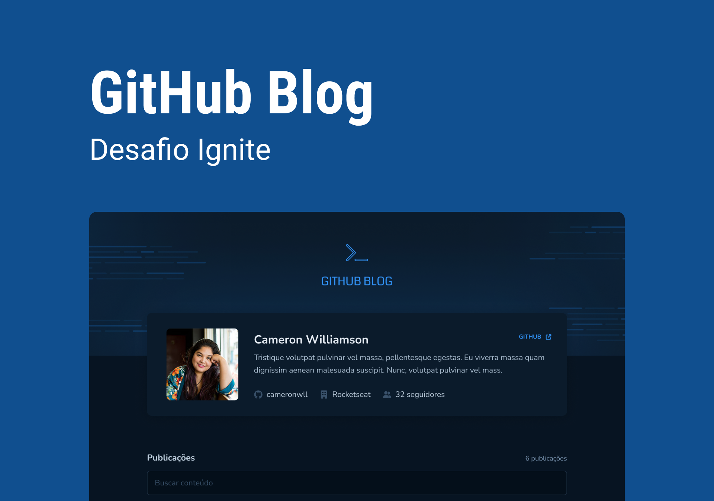

# React JS - Ignite - Desafio 03




Aplicação que simula um blog através de repositórios do Github. Casa issue criada é considerada um post.

#

## Funcionalidades

- Mostrar dados do usuário dono do repositório;
- Listar issues (posts) do repositório;
- Mostrar em detalhe uma issue específica com informações adicionais.


## Stack utilizada

**Front-end:**
- ReactJS
- Vite
- TypeScript


## Rodando localmente

Clone o projeto

```bash
  git clone https://github.com/fellipebastos/ignite-react-js-github-blog.git
```

Entre no diretório do projeto

```bash
  cd ignite-react-js-github-blog
```

Instale as dependências

```bash
  npm install
```

Inicie o servidor

```bash
  npm run dev
```


## Autores

- [@fellipebastos](https://www.github.com/fellipebastos)

